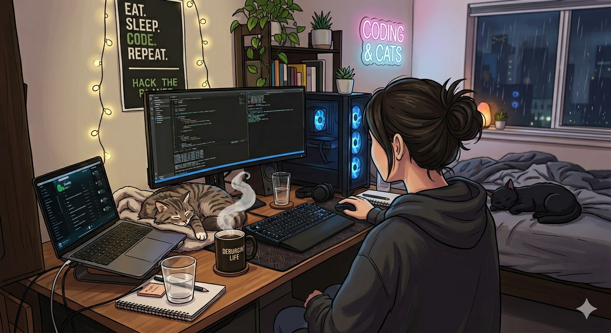

 <h1 style="color: navy;">Laboni Rahman</h1>
  
<b>CS Undergraduate | Aspiring Full-Stack Developer & AI/ML Enthusiast</b>

  

 

  

 

---
## About Me  

As an undergraduate CSE student, I'm very interested in building intelligent systems and bridging the gap between modern AI technologies and scalable software development. I enjoy solving problems, writing clean and efficient code, and continuously learning new technologies.  

- **Current Focus:** Learning and applying **Machine Learning, Deep Learning**, and building **full-stack web applications**  
- **Researching:** **Artificial Intelligence, Digital Access**, and real-world AI solutions  
- **Skills:** Development using **C++,Java, Python**, and modern **web technologies**  
- **Interests:** **Data Structures, Algorithms**, Deep Learning Architechtures and full-stack architectures  
- **Mindset:**  Learn, Experiment, and Build  
- **Contact:** **laboni.rahman.a3@gmail.com**
**Portfolio:** 

###  Open to Collaborate On
-  AI / Machine Learning Projects  
-  Web Development Projects  
-  Beginner-friendly Open Source Contributions  
-  Scalable Sowftware Development  

---

##  Languages & Tools

<table align="center">
  <tr>
    <td align="center" width="50%">
      <b>🌐 Languages</b>  
      
    </td>
    <td align="center" width="50%">
      <b> Frontend & UI</b>  
      
      
    </td>
  </tr>
  <tr>
    <td align="center" width="50%">
      <b> Backend Technology</b>  
      
    </td>
    <td align="center" width="50%">
      <b> Databases</b>  
      
    </td>
  </tr>
  <tr>
    <td align="center" width="50%">
      <b> AI & Machine Learning</b>  
      
      
    </td>
    <td align="center" width="50%">
      <b>Mobile Development</b>  
      
    </td>
  </tr>
  <tr>
    <td align="center" width="50%">
      <b>Tools & DevOps</b>  
      
    </td>
  </tr>
</table>

### 🌐 Connect With Me

  
  
  

